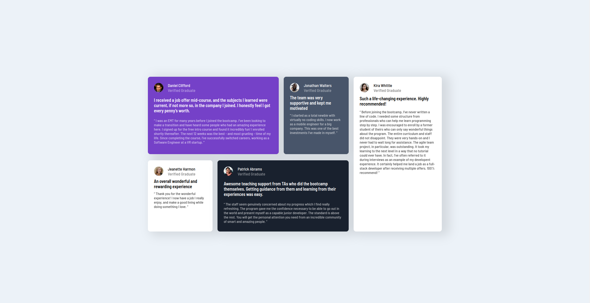

# Frontend Mentor - Testimonials grid section solution

This is a solution to the [Testimonials grid section challenge on Frontend Mentor](https://www.frontendmentor.io/challenges/testimonials-grid-section-Nnw6J7Un7). Frontend Mentor challenges help you improve your coding skills by building realistic projects. 

## Table of contents

- [Overview](#overview)
  - [The challenge](#the-challenge)
  - [Screenshot](#screenshot)
  - [Links](#links)
- [My process](#my-process)
  - [Built with](#built-with)
  - [What I learned](#what-i-learned)
  - [Continued development](#continued-development)
- [Author](#Author)
- [Acknowledgments](#acknowledgments)

**Note: Delete this note and update the table of contents based on what sections you keep.**

## Overview

### The challenge

Users should be able to:

- View the optimal layout for the site depending on their device's screen size

### Screenshot



### Links

- Solution URL: [Solution URL](https://github.com/PriyanshuSahani/testimonial-grid-frontendmentor)
- Live Site URL: [Live site URL](https://priyanshusahani.github.io/testimonial-grid-frontendmentor/)

## My process

- I put the cards in a row using flexbox
- I set the right margin of four cards in left to get optimal gaps without any redundancy.
- For the horizontal gap I used flexbox property justify-content.
- All the individual cards follow the same styles.

### Built with

- HTML5 markup
- CSS custom properties
- Flexbox
- Mobile-first workflow


### What I learned

```
#main-container {
        flex-direction: row;
        max-width: 950px;
        height: 500px;
        margin: auto;
    }
```
Here setting `margin: auto;` makes the flex item obey it's aligning across the axes. 


### Continued development

I'm a beginner. Whatever I've used in this project is pretty much the extent of my knowledge. So for now I will continue to learn new topics and and make projects as I 

## Author

- Frontend Mentor - [PriyanshuSahani](https://www.frontendmentor.io/profile/PriyanshuSahani)

## Acknowledgments

This [YouTube Channel](https://www.youtube.com/@zachgoll) has excellent tutorials on frontend development.
